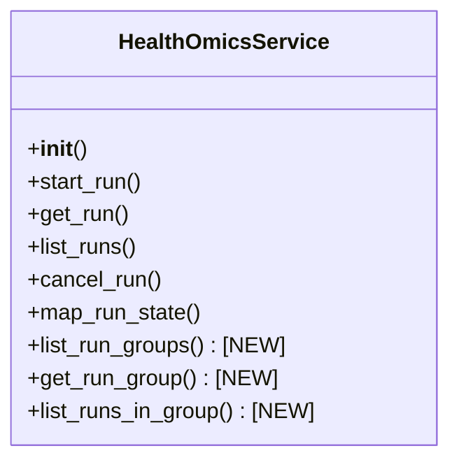
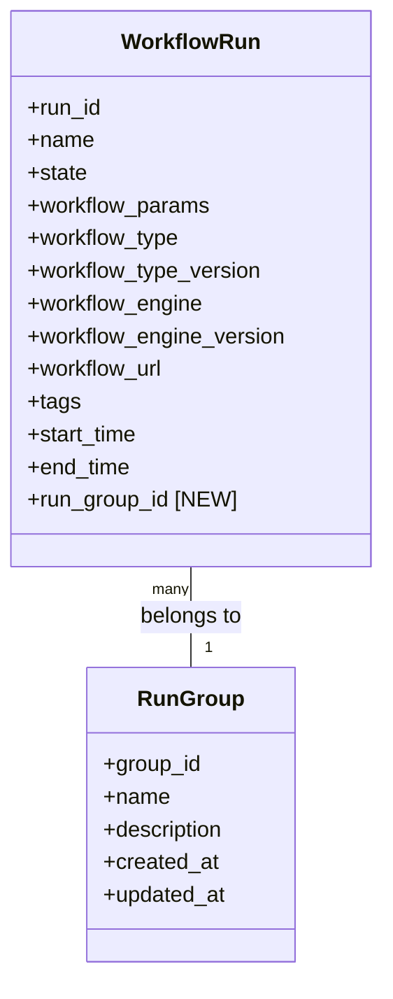
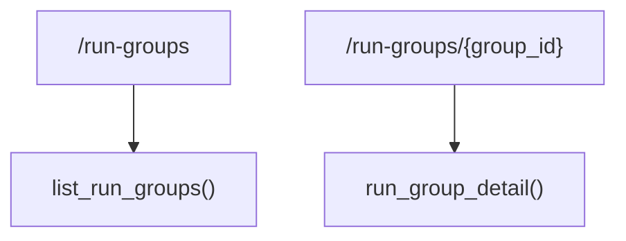

# Run Groups Implementation Plan

## 1. Understanding the Current System

The current system:
- Uses AWS HealthOmics service for workflow execution
- Implements the GA4GH WES API
- Has a web UI for viewing and managing workflow runs
- Does not currently expose run groups functionality

## 2. Implementation Plan

### 2.1 Update AWS HealthOmics Service Integration

We need to extend the `HealthOmicsService` class in `app/services/aws_omics.py` to add methods for:



New methods to add:
1. `list_run_groups()`: List all run groups
2. `get_run_group(group_id)`: Get details of a specific run group
3. `list_runs_in_group(group_id)`: List all runs within a specific run group

### 2.2 Update Data Model (Optional)

If we want to store run group information locally, we'll need to update the data model in `app/models/workflow.py`:



### 2.3 Create Web Routes

Add new routes in `app/web/__init__.py`:



1. `/run-groups`: List all run groups
2. `/run-groups/{group_id}`: Show details of a specific run group and its runs

### 2.4 Create Templates

Create new templates:
1. `app/templates/run_groups.html`: List all run groups
2. `app/templates/run_group_detail.html`: Show details of a specific run group and its runs

### 2.5 Update Navigation

Update the navigation in `app/templates/base.html` to include a link to the run groups page:

```html
<li class="nav-item">
    <a class="nav-link" href="{{ url_for('web.run_groups') }}">Run Groups</a>
</li>
```

### 2.6 Update API (Optional)

If we want to expose run groups through the API, we'll need to extend the API in `app/api/wes.py`.

## 3. Detailed Implementation Steps

### Step 1: Update AWS HealthOmics Service Integration

1. Add new methods to `HealthOmicsService` class in `app/services/aws_omics.py`:
   ```python
   def list_run_groups(self, next_token=None, max_results=100):
       """List run groups"""
       try:
           params = {'maxResults': max_results}
           if next_token:
               params['startingToken'] = next_token
           response = self.client.list_run_groups(**params)
           return response
       except ClientError as error:
           raise RuntimeError(f"Failed to list run groups: {str(error)}") from error

   def get_run_group(self, group_id):
       """Get run group details"""
       try:
           response = self.client.get_run_group(id=group_id)
           return response
       except ClientError as error:
           raise RuntimeError(f"Failed to get run group {group_id}: {str(error)}") from error

   def list_runs_in_group(self, group_id, next_token=None, max_results=100):
       """List runs in a specific run group"""
       try:
           params = {
               'runGroupId': group_id,
               'maxResults': max_results
           }
           if next_token:
               params['startingToken'] = next_token
           response = self.client.list_runs(**params)
           return response
       except ClientError as error:
           raise RuntimeError(f"Failed to list runs in group {group_id}: {str(error)}") from error
   ```

### Step 2: Create Web Routes

1. Add new routes to `app/web/__init__.py`:
   ```python
   @web.route('/run-groups')
   def run_groups():
       try:
           # List all run groups from AWS HealthOmics
           groups_list = []
           next_token = None
           while True:
               response = omics_service.list_run_groups(next_token=next_token)
               for group in response.get('items', []):
                   groups_list.append({
                       'group_id': group['id'],
                       'name': group.get('name', 'Unnamed Group'),
                       'description': group.get('description', ''),
                       'created_at': group.get('creationTime')
                   })
               next_token = response.get('nextToken')
               if not next_token:
                   break
           return render_template('run_groups.html', groups=groups_list)
       except Exception as e:
           current_app.logger.error(f"Failed to list run groups: {str(e)}")
           flash(f"Error: {str(e)}", 'error')
           return render_template('run_groups.html', groups=[])

   @web.route('/run-groups/<group_id>')
   def run_group_detail(group_id):
       try:
           # Get run group details
           group = omics_service.get_run_group(group_id)
           
           # List runs in this group
           runs_list = []
           next_token = None
           while True:
               response = omics_service.list_runs_in_group(group_id, next_token=next_token)
               for run in response.get('items', []):
                   runs_list.append({
                       'run_id': run['id'],
                       'name': run.get('name', 'Unnamed Run'),
                       'state': omics_service.map_run_state(run['status']),
                       'start_time': run.get('startTime'),
                       'end_time': run.get('stopTime')
                   })
               next_token = response.get('nextToken')
               if not next_token:
                   break
                   
           group_data = {
               'group_id': group_id,
               'name': group.get('name', 'Unnamed Group'),
               'description': group.get('description', ''),
               'created_at': group.get('creationTime')
           }
           
           return render_template('run_group_detail.html', group=group_data, runs=runs_list)
       except Exception as e:
           current_app.logger.error(f"Failed to get run group details: {str(e)}")
           flash(f"Error: {str(e)}", 'error')
           return redirect(url_for('web.run_groups'))
   ```

### Step 3: Create Templates

1. Create `app/templates/run_groups.html`:
   ```html
   

   
   <h2>Run Groups</h2>
   <div class="table-responsive">
       <table id="run-groups-table" class="table table-striped">
           <thead>
               <tr>
                   <th>Group ID</th>
                   <th>Name</th>
                   <th>Description</th>
                   <th>Created At</th>
                   <th>Actions</th>
               </tr>
           </thead>
           <tbody>
               
               <tr>
                   <td>{{ group.group_id }}</td>
                   <td>{{ group.name }}</td>
                   <td>{{ group.description }}</td>
                   <td>{{ group.created_at|datetime }}</td>
                   <td>
                       <a href="{{ url_for('web.run_group_detail', group_id=group.group_id) }}" class="btn btn-sm btn-info">View Runs</a>
                   </td>
               </tr>
               
           </tbody>
       </table>
   </div>
   

   
   <script>
   $(document).ready(function() {
       $('#run-groups-table').DataTable({
           pageLength: 25,
           order: [[3, 'desc']], // Sort by Created At descending by default
           columns: [
               null,                  // Group ID
               null,                  // Name
               null,                  // Description
               null,                  // Created At
               { orderable: false }   // Actions
           ]
       });
   });
   </script>
   
   ```

2. Create `app/templates/run_group_detail.html`:
   ```html
   

   
   <div class="mb-4">
       <h2>Run Group: {{ group.name }}</h2>
       <p><strong>Group ID:</strong> {{ group.group_id }}</p>
       <p><strong>Description:</strong> {{ group.description }}</p>
       <p><strong>Created At:</strong> {{ group.created_at|datetime }}</p>
   </div>

   <h3>Runs in this Group</h3>
   <div class="table-responsive">
       <table id="runs-table" class="table table-striped">
           <thead>
               <tr>
                   <th>Run ID</th>
                   <th>Status</th>
                   <th>Name</th>
                   <th>Start Time</th>
                   <th>End Time</th>
                   <th>Actions</th>
               </tr>
           </thead>
           <tbody>
               
               <tr>
                   <td>{{ run.run_id }}</td>
                   <td><span class="badge bg-{{ run.state|state_to_bootstrap }}">{{ run.state }}</span></td>
                   <td>{{ run.name }}</td>
                   <td>{{ run.start_time|datetime }}</td>
                   <td>{{ run.end_time|datetime }}</td>
                   <td>
                       <a href="{{ url_for('web.run_detail', run_id=run.run_id) }}" class="btn btn-sm btn-info">Details</a>
                       
                       <form method="POST" action="{{ url_for('web.cancel_run', run_id=run.run_id) }}" style="display: inline;">
                           <button type="submit" class="btn btn-sm btn-danger">Cancel</button>
                       </form>
                       
                   </td>
               </tr>
               
           </tbody>
       </table>
   </div>
   

   
   <script>
   $(document).ready(function() {
       $('#runs-table').DataTable({
           pageLength: 25,
           order: [[3, 'desc']], // Sort by Start Time descending by default
           columns: [
               null,                  // Run ID
               { orderable: false },  // Status
               null,                  // Name
               null,                  // Start Time
               null,                  // End Time
               { orderable: false }   // Actions
           ]
       });
   });
   </script>
   
   ```

### Step 4: Update Navigation

1. Update `app/templates/base.html` to add a link to run groups:
   ```html
   <li class="nav-item">
       <a class="nav-link" href="{{ url_for('web.run_groups') }}">Run Groups</a>
   </li>
   ```

### Step 5: Update Run Detail Page (Optional)

1. Update `app/templates/run_detail.html` to show run group information if available.

## 4. Testing Plan

1. Test listing run groups
2. Test viewing run group details
3. Test listing runs within a run group
4. Test navigation between run groups and individual runs

## 5. Future Enhancements

1. Add ability to create new run groups
2. Add ability to add runs to existing run groups
3. Add ability to remove runs from run groups
4. Add filtering and searching capabilities for run groups