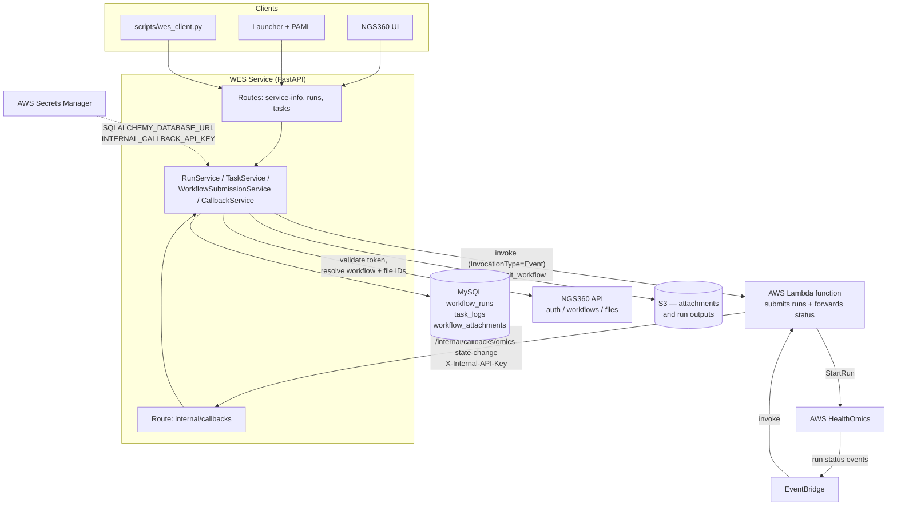
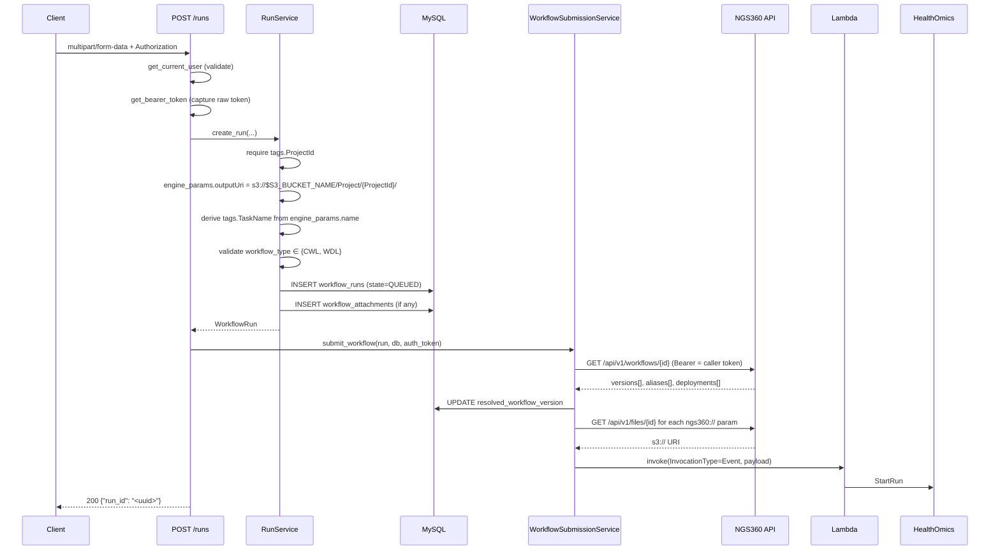
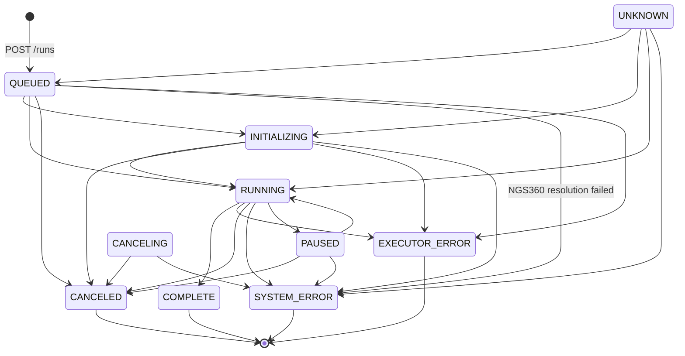

# GA4GH WES API Service — Architecture

**Status:** describes the code as it exists on `main`. Last verified 2026-09-30.

This service implements the
[GA4GH Workflow Execution Service (WES) API v1.1.0](https://github.com/ga4gh/workflow-execution-service-schemas)
on top of **AWS HealthOmics**, with **NGS360** as the workflow registry and
identity provider.

It is a *stateless request-handling service*, not an execution engine. It
persists every run request to MySQL, delegates actual execution to an AWS Lambda
function, and learns about state changes through an EventBridge-driven callback.
Nothing in the service polls for status, and no background process runs alongside
the web workers.

---

## Table of Contents

1. [Technology Stack](#1-technology-stack)
2. [Runtime Topology](#2-runtime-topology)
3. [Project Structure](#3-project-structure)
4. [Request Flow: Workflow Submission](#4-request-flow-workflow-submission)
5. [Request Flow: State Change Callback](#5-request-flow-state-change-callback)
6. [NGS360 Integration](#6-ngs360-integration)
7. [Database Schema](#7-database-schema)
8. [Authentication & Authorization](#8-authentication--authorization)
9. [API Surface](#9-api-surface)
10. [Storage Layer](#10-storage-layer)
11. [Configuration](#11-configuration)
12. [Error Handling](#12-error-handling)
13. [Testing](#13-testing)
14. [Known Gaps & Limitations](#14-known-gaps--limitations)

---

## 1. Technology Stack

| Concern         | Choice                                                            |
| --------------- | ----------------------------------------------------------------- |
| Language        | Python 3.12+                                                      |
| Web framework   | FastAPI (fully async)                                             |
| Package manager | uv (`uv sync`, `uv.lock`)                                         |
| Database        | MySQL 8 via SQLAlchemy 2.x async ORM + `aiomysql`                 |
| Migrations      | Alembic                                                           |
| Validation      | Pydantic v2 / `pydantic-settings`                                 |
| HTTP client     | `httpx.AsyncClient` (outbound NGS360 calls)                       |
| AWS SDK         | `boto3` (Lambda invoke, S3, Secrets Manager)                      |
| Token cache     | `cachetools.TTLCache`                                             |
| Passwords       | `passlib` + bcrypt                                                |
| Tests           | pytest / pytest-asyncio (`asyncio_mode = "auto"`)                 |
| Lint            | flake8 (`make lint`) — not ruff; ruff/mypy config exists but is unused in CI |
| Production WSGI | gunicorn + `uvicorn.workers.UvicornWorker` (see `Procfile`)       |

---

## 2. Runtime Topology


```mermaid
graph TB
    subgraph Clients
        NGS360UI[NGS360 UI]
        Launcher[Launcher + PAML]
        CLI[scripts/wes_client.py]
    end

    subgraph "WES Service (FastAPI)"
        API[Routes: service-info, runs, tasks]
        CB[Route: internal/callbacks]
        SVC[RunService / TaskService /<br/>WorkflowSubmissionService / CallbackService]
    end

    DB[(MySQL<br/>workflow_runs<br/>task_logs<br/>workflow_attachments)]
    NGS360[NGS360 API<br/>auth / workflows / files]
    SM[AWS Secrets Manager]
    S3[(S3 — attachments<br/>and run outputs)]
    Lambda[AWS Lambda function<br/>submits runs + forwards status]
    Omics[AWS HealthOmics]
    EB[EventBridge]

    NGS360UI --> API
    Launcher --> API
    CLI --> API

    API --> SVC
    CB --> SVC
    SVC --> DB
    SVC --> S3
    SVC -->|"validate token,<br/>resolve workflow + file IDs"| NGS360
    SVC -->|"invoke (InvocationType=Event)<br/>action: submit_workflow"| Lambda
    Lambda -->|StartRun| Omics
    Omics -->|run status events| EB
    EB -->|invoke| Lambda
    Lambda -->|"POST /internal/callbacks/omics-state-change<br/>X-Internal-API-Key"| CB
    SM -.->|"SQLALCHEMY_DATABASE_URI,<br/>INTERNAL_CALLBACK_API_KEY"| SVC
```

Key properties:

- **The WES service never calls HealthOmics directly.** All HealthOmics
  interaction is owned by the Lambda function. This service only knows
  `workflow_run_id` (the Omics run ID) as an opaque string.
- **One Lambda function, two triggers.** The function named by
  `LAMBDA_FUNCTION_NAME` is invoked by this service to submit runs, and by
  EventBridge to report HealthOmics status changes back to the callback endpoint.
  There is no separate callback function.
- **Submission is fire-and-forget.** `lambda_client.invoke` uses
  `InvocationType='Event'`, so `POST /runs` returns as soon as Lambda accepts
  the event.
- **State is push-based.** The service does not poll HealthOmics; it waits for
  callbacks derived from EventBridge events.
- **The service is stateless** apart from an in-process token cache, so it
  scales horizontally behind a load balancer.

---

## 3. Project Structure

```
GA4GH-WES-API-Service/
├── src/wes_service/
│   ├── main.py                        # App factory, CORS, router wiring, /healthcheck
│   ├── config.py                      # Settings + AWS Secrets Manager fallback
│   ├── api/
│   │   ├── deps.py                    # DatabaseSession, CurrentUser, CurrentToken, Storage
│   │   ├── routes/
│   │   │   ├── service_info.py        # GET /service-info
│   │   │   ├── runs.py                # /runs endpoints
│   │   │   ├── tasks.py               # /runs/{id}/tasks endpoints
│   │   │   └── callbacks.py           # POST /internal/callbacks/omics-state-change
│   │   └── middleware/
│   │       ├── error_handler.py       # Global exception handlers
│   │       └── response_formatter.py  # Trailing-newline ASGI middleware (unused)
│   ├── core/
│   │   ├── security.py                # Basic auth, NGS360 token auth, token cache
│   │   ├── callback_auth.py           # X-Internal-API-Key verification
│   │   └── storage.py                 # Local + S3 storage backends
│   ├── db/
│   │   ├── base.py                    # Declarative Base
│   │   ├── models.py                  # WorkflowRun, TaskLog, WorkflowAttachment
│   │   └── session.py                 # Async engine + get_db dependency
│   ├── schemas/                       # service_info, run, task, callback, common
│   └── services/
│       ├── run_service.py             # Run create / list / status / log / cancel
│       ├── task_service.py            # Task list / get
│       ├── workflow_submission_service.py  # NGS360 resolution + Lambda invoke
│       └── callback_service.py        # State-change reconciliation
├── alembic/versions/                  # 6 migrations, linear chain
├── tests/{api,core,services,integration}/
├── scripts/wes_client.py              # Reference Python client + CLI
├── examples/{workflows,inputs}/
├── Makefile                           # build / test / run / lint / migrate-*
├── Procfile                           # gunicorn entrypoint
└── workflow_execution_service.openapi.yaml   # Upstream GA4GH spec, for reference
```

---

## 4. Request Flow: Workflow Submission


```mermaid
sequenceDiagram
    participant C as Client
    participant R as POST /runs
    participant RS as RunService
    participant DB as MySQL
    participant WS as WorkflowSubmissionService
    participant N as NGS360 API
    participant L as Lambda
    participant O as HealthOmics

    C->>R: multipart/form-data + Authorization
    R->>R: get_current_user (validate)
    R->>R: get_bearer_token (capture raw token)
    R->>RS: create_run(...)
    RS->>RS: require tags.ProjectId
    RS->>RS: engine_params.outputUri = s3://$S3_BUCKET_NAME/Project/{ProjectId}/
    RS->>RS: derive tags.TaskName from engine_params.name
    RS->>RS: validate workflow_type ∈ {CWL, WDL}
    RS->>DB: INSERT workflow_runs (state=QUEUED)
    RS->>DB: INSERT workflow_attachments (if any)
    RS-->>R: WorkflowRun

    R->>WS: submit_workflow(run, db, auth_token)
    WS->>N: GET /api/v1/workflows/{id}  (Bearer = caller token)
    N-->>WS: versions[], aliases[], deployments[]
    WS->>DB: UPDATE resolved_workflow_version
    WS->>N: GET /api/v1/files/{id} for each ngs360:// param
    N-->>WS: s3:// URI
    WS->>L: invoke(InvocationType=Event, payload)
    L->>O: StartRun
    R-->>C: 200 {"run_id": "<uuid>"}
```

### 4.1 What `create_run` enforces

- `tags.ProjectId` is **required**. Missing it raises `ValueError`, which the
  route converts to **HTTP 500** with the message
  `Job Submission Failed: ProjectId tag is required but not provided in tags`.
- `workflow_engine_parameters.outputUri` is **overwritten** by the service to
  `s3://{S3_BUCKET_NAME}/Project/{ProjectId}/`. A client-supplied `outputUri`
  is ignored.
- `tags.TaskName` defaults to `workflow_engine_parameters.name` when absent.
  The `task_name` column falls back to `wes-run-{uuid}` if neither is present.
- `workflow_type` must be `CWL` or `WDL` (case-insensitive; stored uppercase).

### 4.2 Failure semantics

Submission runs **inline within the POST request**, but its failures do not
fail the request:

- Errors raised out of `submit_workflow` are caught and logged by the route;
  the client still receives `200` and a `run_id`.
- NGS360 resolution failures and `ngs360://` resolution failures are handled
  *inside* `submit_workflow`: the run is set to `SYSTEM_ERROR`, the reason is
  appended to `system_logs`, and the function returns without invoking Lambda.

So a `200` from `POST /runs` means "request recorded", not "workflow started".
Clients must poll `GET /runs/{run_id}/status`.

### 4.3 Lambda payload contract

```jsonc
{
  "action": "submit_workflow",
  "source": "ga4ghwes",
  "wes_run_id": "<WES run UUID>",
  "workflow_id": "<engine_id — the HealthOmics workflow ARN/ID from NGS360>",
  "workflow_version": "<workflow_params.workflow_version, or null>",
  "workflow_type": "WDL" | "CWL",
  "parameters": { /* workflow_params with ngs360:// resolved to s3:// */ },
  "workflow_engine_parameters": { "outputUri": "s3://...", "...": "..." },
  "tags": {
    "Project": "<renamed from ProjectId>",
    "TaskName": "...",
    "WESRunId": "<WES run UUID>",
    "callback_url": "<CLIENT_ORIGIN><API_PREFIX>/internal/callbacks/omics-state-change"
  }
}
```

Two details worth knowing:

- The outgoing `ProjectId` tag is renamed to **`Project`** so the HealthOmics run
  carries the AWS cost-allocation tag key. The database keeps `ProjectId`.
- `callback_url` is built from `CLIENT_ORIGIN` + `API_PREFIX`. If `CLIENT_ORIGIN`
  is empty the callback URL is relative and the Lambda cannot reach back.

---

## 5. Request Flow: State Change Callback

`POST {API_PREFIX}/internal/callbacks/omics-state-change` — **not part of the
GA4GH spec**, a local extension.

Authentication is a shared secret in the `X-Internal-API-Key` header, compared
against `INTERNAL_CALLBACK_API_KEY`:

| Condition                          | Response |
| ---------------------------------- | -------- |
| `ENABLE_CALLBACK_ENDPOINT` is false | 503      |
| `INTERNAL_CALLBACK_API_KEY` unset  | 500      |
| Header does not match              | 403      |
| Header missing                     | 422 (FastAPI header validation) |

### 5.1 Payload (`OmicsStateChangeCallback`)

| Field             | Required | Notes                                        |
| ----------------- | -------- | -------------------------------------------- |
| `wes_run_id`      | yes      | Exactly 36 chars (UUID)                      |
| `status`          | yes      | `OmicsRunStatus` enum (see table below)      |
| `event_time`      | yes      | Timestamp from the EventBridge event         |
| `omics_run_id`    | no       | Backfilled into `workflow_run_id` if not set |
| `event_id`        | no       | EventBridge event ID, used for idempotency   |
| `status_message`  | no       | Appended to `system_logs` as `Status: ...`   |
| `failure_reason`  | no       | Appended as `Failure reason: ...`            |
| `output_mapping`  | no       | Stored at `outputs.output_mapping` on COMPLETE |
| `log_urls`        | no       | Stored at `outputs.log_urls` on any terminal state |

### 5.2 HealthOmics status → WES state

| HealthOmics status                                       | WES state        |
| -------------------------------------------------------- | ---------------- |
| `PENDING`, `QUEUED`, `STARTING`, `RUNNING`, `STOPPING`, `TERMINATING` | `RUNNING`        |
| `COMPLETED`                                              | `COMPLETE`       |
| `FAILED`                                                 | `EXECUTOR_ERROR` |
| `CANCELLED`, `CANCELLED_RUNNING`, `CANCELLED_STARTING`   | `CANCELED`       |

An unmapped status returns **400**.

### 5.3 Reconciliation order (`CallbackService.handle_omics_state_change`)

1. Load the run, **404** if unknown.
2. If `event_id` equals the stored `last_event_id`, return
   `already_processed: true` and stop (idempotency).
3. Backfill `workflow_run_id` from `omics_run_id` if empty.
4. Map the status to a `WorkflowState`, **400** if unmapped.
5. On the first `RUNNING` event, set `start_time = event_time`.
6. If the mapped state equals the current state, return `"No state change"`.
7. Validate the transition:
   - valid → continue;
   - already terminal → return success with `"Run already in terminal state ..."`;
   - otherwise → **400** `"Invalid state transition"`.
8. Apply: `state`, `last_callback_time`, `last_event_id`, append log lines, and
   for terminal states set `end_time`, `outputs`, and `exit_code`
   (`0` for `COMPLETE`, `1` otherwise).

### 5.4 State machine


```mermaid
stateDiagram-v2
    [*] --> QUEUED: POST /runs
    QUEUED --> INITIALIZING
    QUEUED --> RUNNING
    QUEUED --> CANCELED
    QUEUED --> SYSTEM_ERROR: NGS360 resolution failed
    QUEUED --> EXECUTOR_ERROR
    INITIALIZING --> RUNNING
    INITIALIZING --> CANCELED
    INITIALIZING --> EXECUTOR_ERROR
    INITIALIZING --> SYSTEM_ERROR
    RUNNING --> COMPLETE
    RUNNING --> EXECUTOR_ERROR
    RUNNING --> CANCELED
    RUNNING --> SYSTEM_ERROR
    RUNNING --> PAUSED
    PAUSED --> RUNNING
    PAUSED --> CANCELED
    PAUSED --> SYSTEM_ERROR
    CANCELING --> CANCELED
    CANCELING --> SYSTEM_ERROR
    UNKNOWN --> QUEUED
    UNKNOWN --> INITIALIZING
    UNKNOWN --> RUNNING
    UNKNOWN --> SYSTEM_ERROR
    COMPLETE --> [*]
    EXECUTOR_ERROR --> [*]
    SYSTEM_ERROR --> [*]
    CANCELED --> [*]
```

`PREEMPTED` exists in the `WorkflowState` enum for GA4GH compliance but no
transition ever produces it. `CANCELING` is only reachable via
`POST /runs/{id}/cancel`.

---

## 6. NGS360 Integration

The service depends on NGS360 for three things. All outbound calls carry
`X-Client-Application: ngs360-ga4gh`, `User-Agent: ngs360-ga4gh/1.0`, and — when
the caller supplied one — `Authorization: Bearer <caller token>`, so NGS360
attributes reads to the real user rather than to an anonymous service.

| Purpose             | Endpoint                          |
| ------------------- | --------------------------------- |
| Token validation    | `GET /api/v1/auth/me`             |
| Workflow resolution | `GET /api/v1/workflows/{id}`      |
| File ID resolution  | `GET /api/v1/files/{id}`          |

### 6.1 `workflow_url` grammar

```
workflow_url ::= NGS360_WORKFLOW_ID [ ":" ALIAS_OR_VERSION ]
```

More than one `:` is rejected with
`Workflow URL format error - expect NGS360WORKFLOWID[:ALIAS_OR_VERSION]`.

Resolution:

1. `GET /api/v1/workflows/{workflow_id}`.
2. Pick a version:
   - no suffix → the highest `version` in `versions[]`;
   - suffix → match `aliases[].alias` first, then fall back to an exact
     `versions[].version` string match;
   - no match → `RuntimeError`.
3. Pick a deployment: filter `deployments[]` to
   `engine == "AWSHealthOmics (us-east)"` (hard-coded), then take the newest by
   `created_at`. Its `external_id` becomes the Lambda payload's `workflow_id`.
4. Record `resolved_workflow_version = "{workflow_id}:{version}"` on the run.

Step 4 is why the `resolved_workflow_version` column exists: `latest` and
aliases are mutable, so the run row captures exactly which version actually ran.

### 6.2 `ngs360://` file URIs

`workflow_params` are walked recursively (dicts, lists, scalars). Any string of
the form `ngs360://<file-id>` is replaced with the `uri` field from
`GET /api/v1/files/{file-id}`. Lookups are memoised per submission.

Failure modes, all surfaced as `SYSTEM_ERROR` + a `system_logs` entry:

- 404 → `NGS360 file '<id>' not found`
- other non-200 → the FastAPI `detail` message if the body is JSON, else raw text
- resolved `uri` missing or not `s3://` → `... is not backed by S3`

This lets callers submit stable NGS360 file IDs instead of hard-coded S3 paths.

---

## 7. Database Schema

### `workflow_runs`

| Column                      | Type          | Notes                                                        |
| --------------------------- | ------------- | ------------------------------------------------------------ |
| `id`                        | `String(36)`  | PK, UUID4                                                    |
| `state`                     | `Enum`        | indexed, default `QUEUED`                                    |
| `project`                   | `String(50)`  | **not null** — from `tags.ProjectId`                         |
| `task_name`                 | `String(200)` | **not null** — from `tags.TaskName` or `wes-run-{uuid}`       |
| `workflow_type`             | `String(50)`  | `CWL` / `WDL`                                                |
| `workflow_type_version`     | `String(50)`  |                                                              |
| `workflow_url`              | `Text`        | `NGS360WORKFLOWID[:ALIAS_OR_VERSION]`                        |
| `resolved_workflow_version` | `String(50)`  | nullable — version pinned at submission time                 |
| `workflow_params`           | `JSON`        | as submitted, **before** `ngs360://` resolution              |
| `workflow_engine`           | `String(50)`  | nullable                                                     |
| `workflow_engine_version`   | `String(50)`  | nullable                                                     |
| `workflow_engine_parameters`| `JSON`        | includes the service-injected `outputUri`                    |
| `tags`                      | `JSON`        | keeps `ProjectId` (not the outgoing `Project` rename)        |
| `start_time` / `end_time`   | `DateTime`    | set by callbacks                                             |
| `stdout_url` / `stderr_url` | `Text`        | nullable, currently never populated                          |
| `exit_code`                 | `Integer`     | `0` on COMPLETE, `1` on other terminal states                |
| `system_logs`               | `JSON`        | list of strings; errors and status messages                  |
| `workflow_run_id`           | `String(36)`  | indexed — the HealthOmics run ID                             |
| `outputs`                   | `JSON`        | `{"output_mapping": ..., "log_urls": ...}`                   |
| `user_id`                   | `String(255)` | indexed — username from auth                                 |
| `created_at` / `updated_at` | `DateTime`    | `created_at` indexed                                         |
| `last_callback_time`        | `DateTime`    | indexed — last callback that touched the row                 |
| `last_event_id`             | `String(100)` | indexed — EventBridge event ID, idempotency key              |

### `task_logs`

`id`, `run_id` (FK → `workflow_runs.id`, `ON DELETE CASCADE`), `name`, `cmd`
(JSON array), `start_time`, `end_time`, `stdout_url`, `stderr_url`, `exit_code`,
`system_logs`, `tes_uri`, `created_at`, `updated_at`.

Nothing in the service writes `task_logs` today — the table is populated only by
tests. `GET /runs/{id}/tasks` therefore returns an empty list for real runs.

### `workflow_attachments`

`id`, `run_id` (FK, cascade), `filename`, `storage_path`, `content_type`,
`size_bytes`, `created_at`.

### Migration chain

```
001  initial schema
 └─ dd0aa3a42a85  add callback tracking fields (last_callback_time, last_event_id)
     └─ 1c1081db9f3d  add workflow_run_id
         └─ ea7b7b3086d2  add field comment to workflow_run_id
             └─ 61019f4b738b  add project and task_name columns
                 └─ dd9d7ebae80e  add resolved_workflow_version   ← head
```

There is no `run_outputs` table; outputs live in the `outputs` JSON column.

---

## 8. Authentication & Authorization

`AUTH_METHOD` selects the scheme. Both an `HTTPBasic` and an `HTTPBearer`
extractor run with `auto_error=False`, and `get_current_user` dispatches:

| `AUTH_METHOD` | Behaviour                                                                 |
| ------------- | ------------------------------------------------------------------------- |
| `none`        | Returns `"anonymous"`; no credentials needed                              |
| `api_token`   | Bearer token validated against NGS360 `GET /api/v1/auth/me`; the response's `username` becomes the identity |
| `basic`       | HTTP Basic against `BASIC_AUTH_USERS` (bcrypt hashes). If no users are configured, **any** username is accepted (development mode) |
| `oauth2`      | Accepted by config validation but **not implemented** — every request falls through to 401 |

### Token cache

`api_token` validation results are cached in a process-local
`cachetools.TTLCache` keyed on the raw bearer token, guarded by a
`threading.Lock`:

- `ENABLE_TOKEN_CACHE` (default `true`)
- `TOKEN_CACHE_TTL_SECONDS` (default `300`)
- `TOKEN_CACHE_MAX_SIZE` (default `1000`)

`clear_token_cache()` and `invalidate_token(token)` are available for tests and
manual invalidation. Because the cache is per-process, a revoked token can
remain valid for up to the TTL on each running worker.

### Token forwarding

`CurrentToken` (`get_bearer_token`) exposes the *raw* incoming bearer token
separately from the resolved identity. `POST /runs` forwards it to
`WorkflowSubmissionService`, which attaches it to every NGS360 read. This is
distinct from `CurrentUser`, which is only the validated username.

### Authorization model

| Operation                 | Rule                                                        |
| ------------------------- | ----------------------------------------------------------- |
| `GET /runs`               | All authenticated users see **all** runs (no owner filter)   |
| `GET /runs/{id}`, `/status` | Open to any authenticated user                            |
| `GET /runs/{id}/tasks*`   | Open to any authenticated user                              |
| `POST /runs/{id}/cancel`  | **Owner only** — 403 if `run.user_id != current user`       |

`RunService.list_runs` accepts a `user_id` argument, but the route passes
`None`, so per-user filtering is deliberately disabled for reads.

---

## 9. API Surface

All GA4GH endpoints are mounted under `API_PREFIX` (default `/ga4gh/wes/v1`).

### GA4GH WES v1.1.0 (8 endpoints)

| Method | Path                             | Operation       |
| ------ | -------------------------------- | --------------- |
| GET    | `/service-info`                  | GetServiceInfo  |
| GET    | `/runs`                          | ListRuns        |
| POST   | `/runs`                          | RunWorkflow     |
| GET    | `/runs/{run_id}`                 | GetRunLog       |
| GET    | `/runs/{run_id}/status`          | GetRunStatus    |
| POST   | `/runs/{run_id}/cancel`          | CancelRun       |
| GET    | `/runs/{run_id}/tasks`           | ListTasks       |
| GET    | `/runs/{run_id}/tasks/{task_id}` | GetTask         |

### Local extensions

| Method | Path                                             | Notes                       |
| ------ | ------------------------------------------------ | --------------------------- |
| POST   | `{prefix}/internal/callbacks/omics-state-change`  | `X-Internal-API-Key` auth   |
| GET    | `{prefix}/internal/callbacks/health`              | Unauthenticated             |
| GET    | `/healthcheck`                                    | `{"status": "healthy"}`     |
| GET    | `/`                                               | Service name/version/docs   |
| GET    | `{prefix}/docs`, `{prefix}/redoc`, `{prefix}/openapi.json` | Interactive docs   |

### ListRuns filtering

`GET /runs` accepts `page_size`, `page_token`, and `filters` (a URL-encoded JSON
object). Filter semantics, from `RunService._apply_filters_to_query`:

- Keys must name an actual `WorkflowRun` attribute; **unknown keys are silently
  ignored**.
- Scalar value → `column == value`. `state` is coerced to the `WorkflowState`
  enum; an invalid state value makes the filter a no-op rather than an error.
- Dict value → JSON-path match per key on a JSON column, e.g.
  `{"tags": {"ProjectId": "P-123"}}` → `tags->>'$.ProjectId' = 'P-123'`.
- Nested dict/list values are compared against a compact sorted JSON string.
- Any exception while building a filter causes that filter to be dropped
  silently.

Pagination is **offset-based**: `page_token` is a stringified integer offset,
`page_size` defaults to 10 and is capped at 100, and `next_page_token` is `""`
when there are no further pages. Because ordering is `created_at DESC`, new runs
arriving mid-pagination can shift results.

Note the documented filter field list in the route docstring mentions
`task_name` and `project` as "extracted from tags"; in practice they match the
`task_name` and `project` **columns** directly.

---

## 10. Storage Layer

`StorageBackend` (ABC) with `upload_file`, `download_file`, `get_url`,
`delete_file`, `file_exists`. Implementations:

- `LocalStorageBackend` — writes under `LOCAL_STORAGE_PATH`; `_get_full_path`
  resolves and rejects paths that escape the base directory (path-traversal
  guard).
- `S3StorageBackend` — `S3_BUCKET_NAME` / `S3_REGION`, optional explicit
  credentials (falls back to the default boto3 chain when blank).

Selected at request time by `get_storage_backend()` from `STORAGE_BACKEND`.

The storage backend is used **only** for `workflow_attachment` uploads, written
to `runs/{run_id}/attachments/{filename}`. Workflow *outputs* are written
directly by HealthOmics to `s3://{S3_BUCKET_NAME}/Project/{ProjectId}/` and
never pass through this layer. `S3_BUCKET_NAME` is therefore used for two
distinct purposes: attachment storage (when `STORAGE_BACKEND=s3`) and the
HealthOmics `outputUri` prefix (always).

---

## 11. Configuration

Settings resolve in this order (see `Settings._get_config_value`):

1. Environment variable (`.env` is loaded into `os.environ` at import).
2. AWS Secrets Manager — if `ENV_SECRETS` names a secret, it is fetched once
   (region from `AWS_REGION`, default `us-east-1`) and cached on the instance.
3. The field default.

Only two settings use the Secrets Manager path, both exposed as computed
fields: `SQLALCHEMY_DATABASE_URI` and `INTERNAL_CALLBACK_API_KEY`. Everything
else is a plain `pydantic-settings` field read from the environment.

`get_settings()` is `@lru_cache`d, so configuration is read once per process.
At startup `lifespan` logs all settings with `PASSWORD`/`SECRET`/`KEY` values
masked and the DB URI password redacted.

### Settings consumed by this service

| Variable | Default | Used for |
| -------- | ------- | -------- |
| `SQLALCHEMY_DATABASE_URI` | local mysql URI | async engine (pool 10, overflow 20, `pool_pre_ping`) |
| `NGS360_API_URL` | `http://localhost:8000` | auth, workflow, and file lookups |
| `STORAGE_BACKEND` | `local` | `local` or `s3` |
| `LOCAL_STORAGE_PATH` | `/var/wes/storage` | local attachment root |
| `S3_BUCKET_NAME` | `""` | attachment bucket **and** HealthOmics `outputUri` prefix |
| `S3_REGION`, `S3_ACCESS_KEY_ID`, `S3_SECRET_ACCESS_KEY` | — | S3 backend |
| `AUTH_METHOD` | `basic` | `basic`, `api_token`, `none` (`oauth2` unimplemented) |
| `BASIC_AUTH_USERS` | `""` | `user:bcrypt_hash` pairs, comma-separated |
| `ENABLE_TOKEN_CACHE` / `TOKEN_CACHE_TTL_SECONDS` / `TOKEN_CACHE_MAX_SIZE` | `true` / `300` / `1000` | token validation cache |
| `API_PREFIX` | `/ga4gh/wes/v1` | router mount point, docs URLs |
| `CLIENT_ORIGIN` | `""` | origin half of the Lambda `callback_url` |
| `CORS_ORIGINS` | `*` | CORS allow-list |
| `HOST`, `PORT` | `0.0.0.0`, `8000` | uvicorn bind (dev entrypoint) |
| `LOG_LEVEL` | `INFO` | logging level; `DEBUG` also enables SQLAlchemy echo |
| `SERVICE_*`, `AUTH_INSTRUCTIONS_URL` | — | `/service-info` payload |
| `SUPPORTED_WES_VERSIONS`, `WORKFLOW_TYPE_VERSIONS_CWL`, `WORKFLOW_TYPE_VERSIONS_WDL`, `WORKFLOW_ENGINE_VERSIONS_cwltool`, `SUPPORTED_FILESYSTEM_PROTOCOLS` | see `.env.example` | `/service-info`; CWL/WDL keys also gate accepted `workflow_type` |
| `ENABLE_CALLBACK_ENDPOINT` | `true` | 503-gates the callback route |
| `INTERNAL_CALLBACK_API_KEY` | `""` | shared secret for callbacks |
| `ENV_SECRETS`, `AWS_REGION` | — | Secrets Manager lookup |
| `LAMBDA_FUNCTION_NAME`, `LAMBDA_REGION` | — / `us-east-1` | read via `os.environ` in `LambdaWorkflowSubmissionService`, **not** via `Settings` |

### Declared but unused

Each of these is a declared field on `Settings`, so it parses, validates, and
appears in the startup settings log — but no code outside `config.py` reads it.
Setting any of them changes nothing.

| Setting | Declared | Why it does nothing |
| ------- | -------- | ------------------- |
| `WORKFLOW_EXECUTOR` | `config.py:146` | Dead switch. `POST /runs` always constructs `LambdaWorkflowSubmissionService`; nothing branches on the value and no `local` executor exists |
| `OMICS_REGION` | `config.py:152` | The Lambda function owns the HealthOmics region |
| `OMICS_ROLE_ARN` | `config.py:156` | The Lambda function owns the run role |
| `MAX_UPLOAD_SIZE_MB` | `config.py:274` | Feeds the `max_upload_size_bytes` property (`config.py:335`), which has no callers — **no upload size limit is enforced** |
| `MAX_ATTACHMENT_COUNT` | `config.py:278` | **No attachment count limit is enforced** |
| `LOG_FORMAT` | `config.py:246` | Accepts `json`\|`text`; logging is plain text either way |
| `CALLBACK_TIMEOUT_SECONDS` | `config.py:354` | Never read |

Because `model_config` sets `extra="ignore"` (`config.py:59`), any variable that
is not a declared field is silently dropped rather than rejected — so a typo'd
setting name fails quietly instead of erroring at startup.

---

## 12. Error Handling

`add_error_handlers(app)` registers handlers for `ValueError`,
`FileNotFoundError`, `SQLAlchemyError`, and a catch-all `Exception`. Service
code raises `HTTPException` directly for 4xx cases.

The response body follows the GA4GH `ErrorResponse` shape:

```json
{ "msg": "Detailed error message", "status_code": 404 }
```

An HTTP middleware in `main.py` appends a trailing newline to `JSONResponse`
bodies and sets `X-Content-Has-Newline: true`, for friendlier `curl` output.

---

## 13. Testing

```
tests/
├── conftest.py                                  # fixtures (async SQLite, client, faker)
├── api/            test_runs.py, test_service_info.py, test_tasks.py
├── core/           test_config.py, test_security.py, test_storage.py
├── services/       test_run_service.py, test_callback_service.py,
│                   test_workflow_submission_service.py
└── integration/    test_workflow_lifecycle.py
```

Run with `make test` (`uv sync --extra dev && uv run pytest --cov=src
--cov-report=html`). `asyncio_mode = "auto"`, so async tests need no marker.
CI (`.github/workflows/cicd.yml`) runs `flake8 .` and the test suite with
coverage on pushes to `main` and on PRs.

---

## 14. Known Gaps & Limitations

Documented so they are not mistaken for undiscovered bugs:

1. **Cancel does not reach HealthOmics.** `POST /runs/{id}/cancel` only writes
   `CANCELING` to the database. Nothing notifies Lambda or HealthOmics, and no
   code transitions `CANCELING → CANCELED` except an inbound `CANCELLED*`
   callback that HealthOmics will not send unless the run is cancelled out of
   band.
2. **`task_logs` is never populated.** `GET /runs/{run_id}/tasks` always returns
   an empty list for real runs; per-task detail must come from HealthOmics or
   CloudWatch.
3. **`oauth2` auth is unimplemented** — selecting it makes every request 401.
4. **Upload limits are not enforced** despite `MAX_UPLOAD_SIZE_MB` and
   `MAX_ATTACHMENT_COUNT` existing.
5. **`WORKFLOW_EXECUTOR` is dead config.** `POST /runs` always constructs
   `LambdaWorkflowSubmissionService`; there is no local executor, and the
   abstract `WorkflowSubmissionService` base class has exactly one
   implementation.
6. **The HealthOmics engine name is hard-coded** to
   `"AWSHealthOmics (us-east)"` in `_select_deployment`, so deployments in other
   regions or under a different NGS360 engine label are invisible.
7. **`POST /runs` returns 200 even when submission fails.** Callers must check
   run state rather than treating 200 as success.
8. **Missing `ProjectId` yields 500, not 400**, because `create_run` raises
   `ValueError` for what is really a client error.
9. **Offset pagination is not stable** under concurrent inserts
   (`ORDER BY created_at DESC` + `OFFSET`).
10. **Token cache is per-process**, so revocation takes up to
    `TOKEN_CACHE_TTL_SECONDS` per worker.
11. **`scripts/wes_client.py` only supports HTTP Basic auth** — it has no bearer
    token option, so it cannot authenticate against a deployment running
    `AUTH_METHOD=api_token`.
12. **`response_formatter.py` is dead code** — superseded by the inline
    middleware in `main.py`.
13. **Completed HealthOmics runs are retained deliberately.** Do not add
    automatic cleanup of finished runs; the run history is used downstream for
    workflow performance evaluation.

---

## Related Documents

- [README.md](../README.md) — install, configuration, deployment
- [docs/GA4GH-WES-HealthOmics-Guide.md](GA4GH-WES-HealthOmics-Guide.md) — user guide for submitting and monitoring runs
- [docs/NGS360-Integration.md](NGS360-Integration.md) — NGS360 contracts and the callback protocol
- [workflow_execution_service.openapi.yaml](../workflow_execution_service.openapi.yaml) — upstream GA4GH spec
