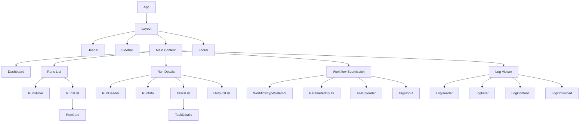
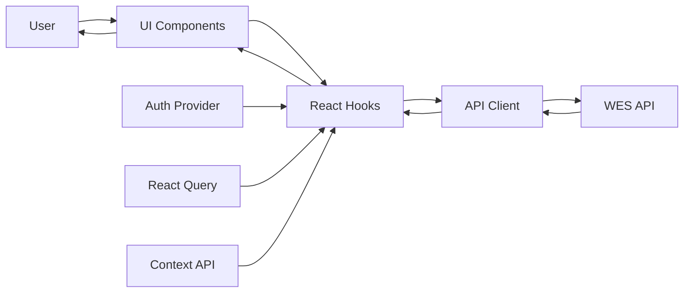
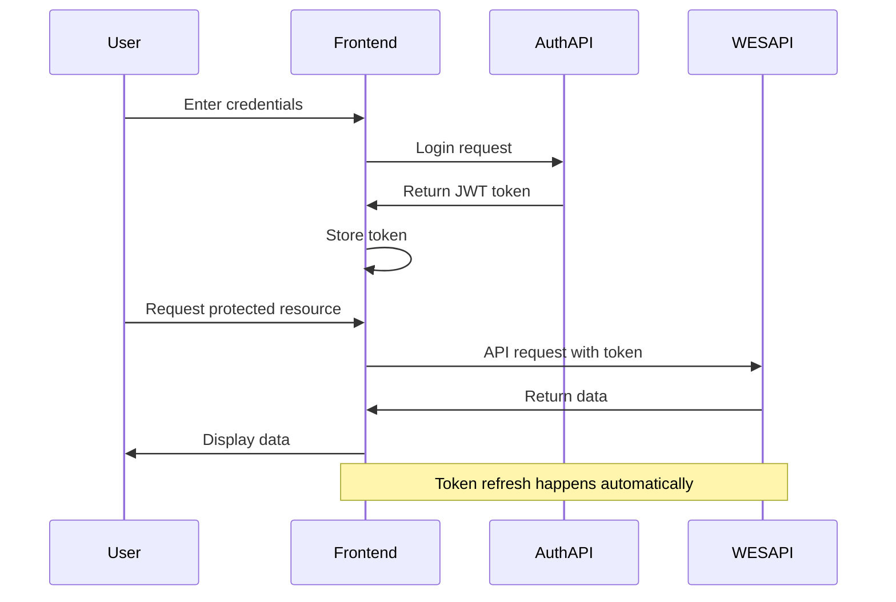
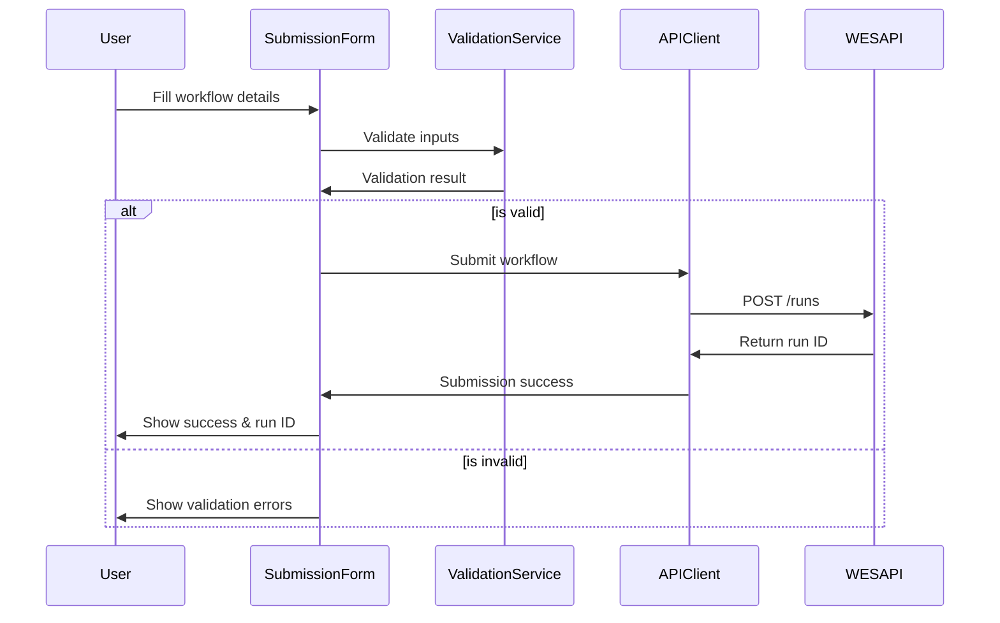
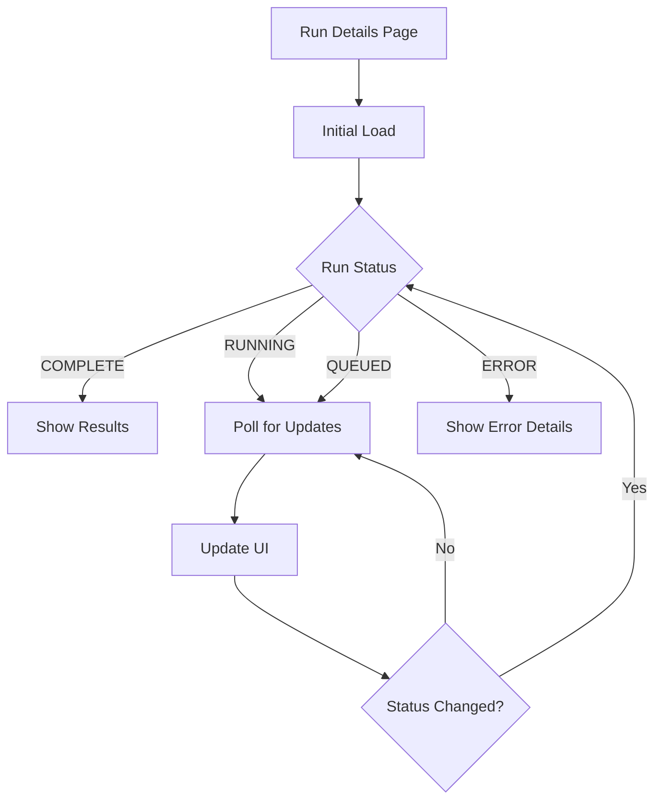
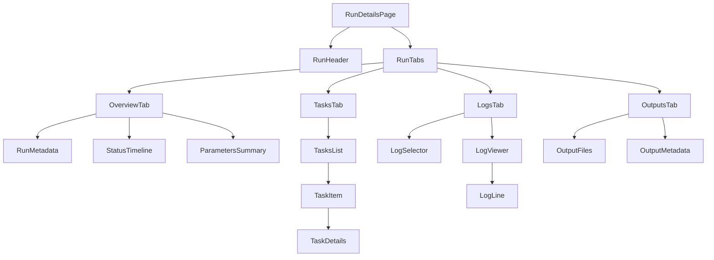
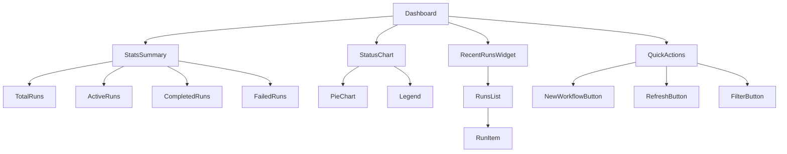
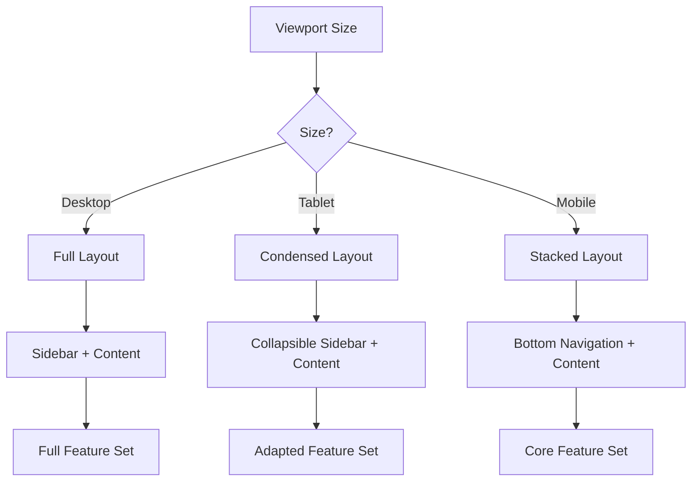
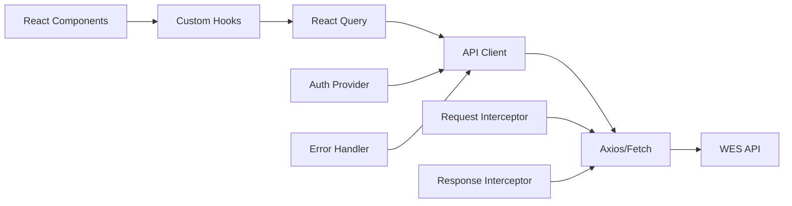

# GA4GH WES Frontend Component Diagrams

This document provides visual representations of the component structure and data flow for the GA4GH WES API Frontend.

## Application Structure



## Data Flow



## Authentication Flow



## Workflow Submission Flow



## Run Status Monitoring



## Component Hierarchy for Run Details



## Dashboard Layout



## Responsive Layout Behavior



## API Integration Architecture



## State Management

```mermaid
graph TD
    A[Application State] --> B[Server State]
    A --> C[UI State]
    A --> D[Auth State]
    
    B --> B1[React Query]
    B1 --> B2[Caching]
    B1 --> B3[Refetching]
    B1 --> B4[Mutations]
    
    C --> C1[React Context]
    C1 --> C2[Theme]
    C1 --> C3[Preferences]
    C1 --> C4[UI Settings]
    
    D --> D1[Auth Context]
    D1 --> D2[User Info]
    D1 --> D3[Permissions]
    D1 --> D4[Token Management]