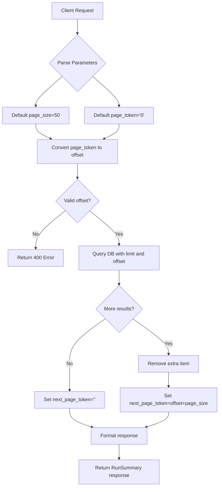

# Implementation Plan: Adding Pagination to WorkflowRuns().get()

## Current Implementation Analysis

The current implementation of the WorkflowRuns().get() method in app/api/wes.py:
```python
@api.doc('list_runs')
def get(self):
    """List workflow runs"""
    runs = WorkflowRunModel.query.all()
    return {
        'runs': [{
            'run_id': run.run_id,
            'state': run.state
        } for run in runs],
        'next_page_token': ''
    }
```

This implementation has the following limitations:
1. It retrieves all workflow runs at once with `query.all()`, which could be inefficient for large datasets
2. It doesn't support pagination parameters (`page_size` and `page_token`)
3. It returns minimal information about each run (only `run_id` and `state`)
4. It always returns an empty `next_page_token`

## Implementation Plan

### 1. Update the API Documentation

First, we'll update the API documentation to include the pagination parameters:

```python
@api.doc('list_runs', params={
    'page_size': 'OPTIONAL: The preferred number of workflow runs to return in a page.',
    'page_token': 'OPTIONAL: Token to use to indicate where to start getting results.'
})
```

### 2. Modify the get() Method to Support Pagination

We'll update the method to:
- Parse the `page_size` and `page_token` query parameters
- Use a default page size of 50 if not provided
- Apply pagination to the database query
- Return enhanced run information (RunSummary format)
- Generate the appropriate `next_page_token`

```python
def get(self):
    """List workflow runs"""
    # Parse pagination parameters
    page_size = request.args.get('page_size', type=int, default=50)
    page_token = request.args.get('page_token', type=str, default='0')
    
    try:
        # Convert page_token to offset
        offset = int(page_token)
    except ValueError:
        # Handle invalid page_token
        return {'msg': 'Invalid page_token', 'status_code': 400}, 400
    
    # Query with pagination
    runs = WorkflowRunModel.query.order_by(WorkflowRunModel.start_time.desc()).limit(page_size + 1).offset(offset).all()
    
    # Check if there are more results
    has_next_page = len(runs) > page_size
    if has_next_page:
        runs = runs[:-1]  # Remove the extra item we fetched
    
    # Generate next_page_token
    next_page_token = str(offset + page_size) if has_next_page else ''
    
    # Format response using RunSummary format
    return {
        'runs': [{
            'run_id': run.run_id,
            'state': run.state,
            'start_time': run.start_time.isoformat() if run.start_time else None,
            'end_time': run.end_time.isoformat() if run.end_time else None,
            'tags': run.tags or {}
        } for run in runs],
        'next_page_token': next_page_token
    }
```

### 3. Import Required Modules

We'll need to add the following import at the top of the file:

```python
from flask import request
```

## Implementation Details

### Pagination Logic

1. **Page Size**: 
   - Default value: 50 items per page
   - User can override with the `page_size` query parameter

2. **Page Token**:
   - Simple numeric offset-based pagination
   - The `page_token` is a string representation of the offset
   - Default value: "0" (start from the beginning)

3. **Next Page Token Generation**:
   - If there are more results available, the `next_page_token` will be set to the next offset
   - If there are no more results, the `next_page_token` will be an empty string

### Response Format

We'll enhance the response to include additional fields according to the RunSummary schema:
- `run_id`: The workflow run ID
- `state`: The current state of the workflow run
- `start_time`: When the run started executing (ISO 8601 format)
- `end_time`: When the run stopped executing (ISO 8601 format)
- `tags`: Key-value tags associated with the run

### Error Handling

We'll add basic error handling for:
- Invalid `page_token` values
- Potential database errors

## Diagram

Here's a flowchart illustrating the pagination logic:



## Testing Considerations

After implementation, we should test:
1. Default pagination (no parameters provided)
2. Custom page size
3. Navigation through pages using the next_page_token
4. Edge cases (empty result set, last page, invalid parameters)